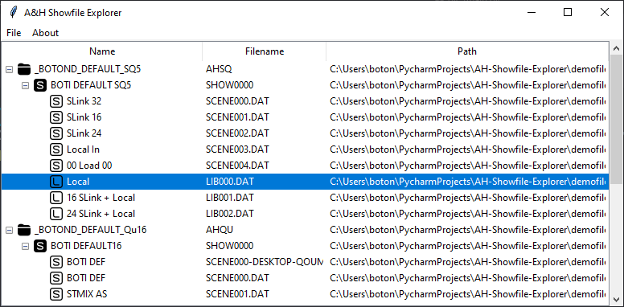

# AH Showfile Explorer

A desktop application for exploring Allen & Heath Qu and SQ series digital mixer showfiles in a human-readable hierarchical format.

## Overview

AH Showfile Explorer is a Python-based GUI tool that parses and displays the internal structure of Allen & Heath digital mixer showfiles. It reads the binary `.DAT` files from Qu and SQ series mixers and presents the data in an intuitive tree view, making it easy to browse shows, scenes, and libraries.

## Features

- **Multi-Format Support**: Compatible with both Allen & Heath Qu and SQ series showfile formats
- **Hierarchical Display**: Tree view showing the complete structure of your showfiles (directories, shows, scenes, and libraries)
- **File Operations**: Built-in context menu for convenient file management
  - Copy files/folders to another location
  - Move files/folders
  - Show in Windows Explorer
- **Smart Scanning**: Automatically detects and navigates showfile directory structures
  - Recognizes AHQU/AHSQ folders
  - Scans SHOWS, SCENES, and LIBRARY subfolders
  - Handles orphaned scene and library files
- **Visual Organization**: Custom icons for different file types
- **Binary Parser**: Extracts human-readable names from binary `.DAT` files

## Usage

1. Launch the application
2. From the menu bar, select **File** → **Open: Qu files** or **Open: SQ files**
3. Browse to the directory containing your showfile data (AHQU/AHSQ folder, SHOWS/SCENES/LIBRARY folders, or any folder containing `.DAT` files)
4. Navigate the tree view to explore your showfile structure
5. Right-click on any item to copy, move, or show in Explorer

## Disclaimer

This is an independent tool and is not affiliated with or endorsed by Allen & Heath. Use at your own risk. Always maintain backups of your showfiles before performing any file operations.
